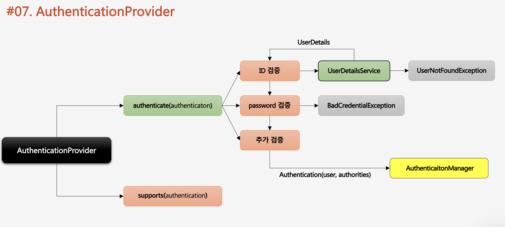

# AuthenticationProvider

1. AuthenticationProvider도 interface이다.
2. authenticate 메소드에서 인증처리 검증을 한다.
3. supports는 form인증, rememberMe의 처리에 대해 옮바른지 검사를 한다.
4. authenticate\(authentication\) authentication에는 아이디와 비밀번호가 있다.
5. ID검증은 UserDetailsService라는 SpringSecurity에서 기본적으로 제공해주는 곳에서 처리한다.
6. password검증에서는 암호화된 패스워드에 대한 검증을 한다.
7. 최종적으로 추가검증을 하고 Authentication에 사용자의 정보, 권한 정보를 저장된 인증객체AuthenticationManager에 부여한다.

Filter -&gt; AuthenticationManager -&gt; AuthenticationProvider -&gt; AuthenticationManager -&gt; Filter-&gt; SecurityContext -&gt; Session 의 흐름을 가진다.

