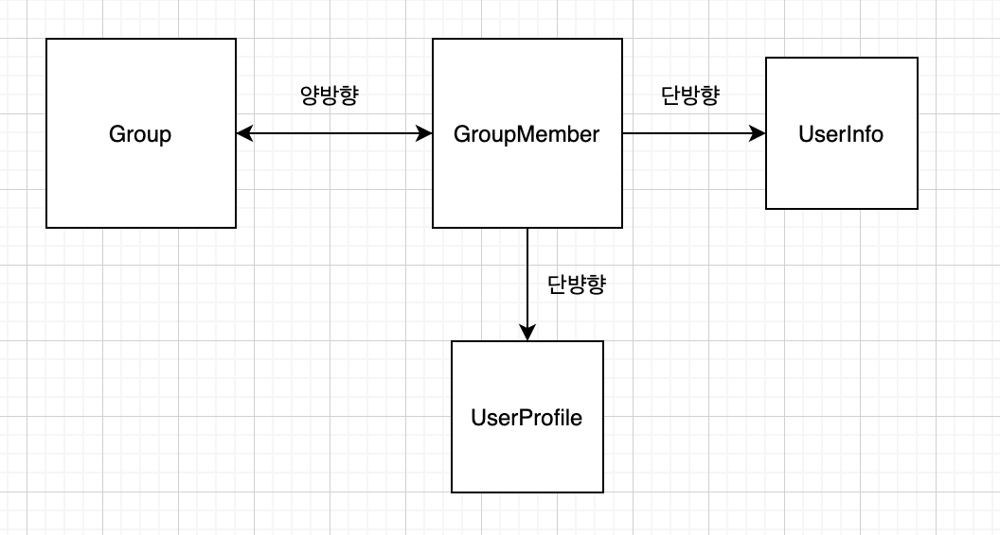

# @CompositeKey에 ManyToOne JoinColumn이 있을 경우



  Group과 GroupMember의 관계는 @ManyToOne 양방향 연관관계이다.

 연관관계의 주인은 @OneToMany인 GroupMember에 설정하였다.

 여기서 GroupMember의 Entity Class 는 아래와 같이 되어있다.

```text
public class GroupMember {

    @EmbeddedId
    private GroupMemberId groupMemberId
    
    @ManyToOne(fetch = FetchType.LAZY)
    @MapsId("gid")
    @JoinColumn("id")
    private Group group
    
    @OneToOne
    @JoinColumn(name="g_id", updateable = false, insertable = false)
    private UserProfile userProfile
    
    @OneToOne
    @JoinColumn(name="g_id", updateable = false, insertable = false)
    private UserInfo userInfo

}

@Embeddedable
public class GroupMemberId implements Serializable{

    @Column(name = "g_id")
    private Long gId
    
    @Column(name = "u_id")
    private Long uId
}
```

Composite key에 만약 @ManyToOne이 들어가야 된다면 IdClass를 사용하거나 이렇게 MapsId를 사용하여야 한다.

만약 Insert를 하려고 한다면, GroupMemberId에서 uId와 Group Entity만 넣어주면 된다.

 즉 gId는 생략해도 된다는 것이다.


