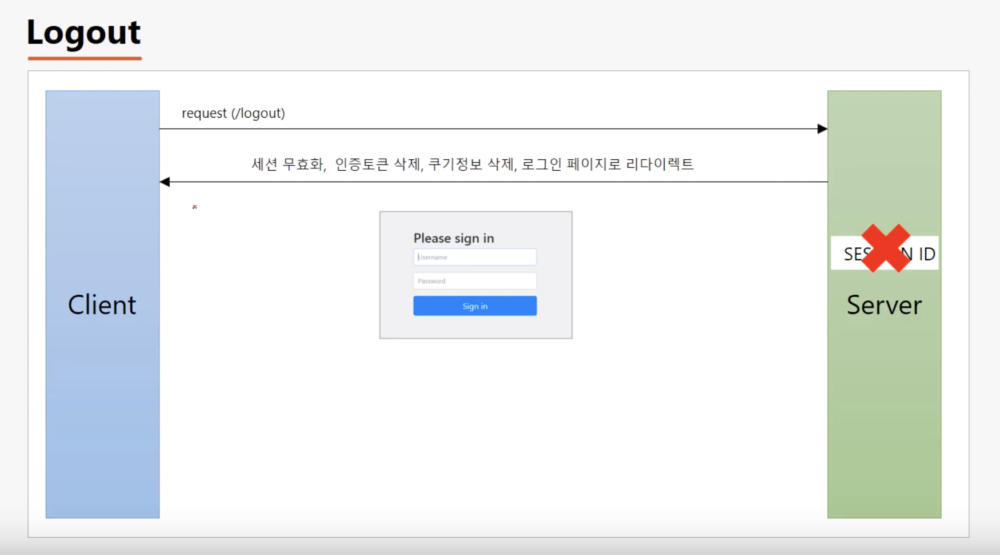
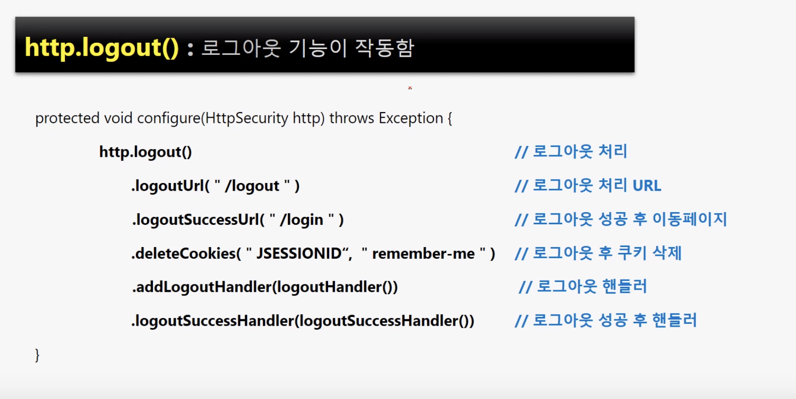
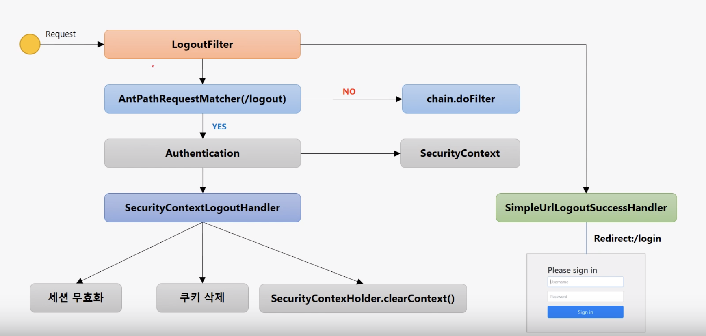

# Logout,LogoutFilter

* 로그아웃을 하면 인증토큰 삭제, 스프링 컨텍스트 삭제, 쿠키 정보 삭제, 로그인 페이지로 리다이렉트 시킨다.

### JSESSIONID ? 

톰캣 컨테이너에서 세션을 유지하기 위해 발급하는 키



### addLogoutHandler 

* 인증토큰 및 세션, 쿠키 삭
* 로그아웃 처리 시 추가적인 기능 추가 가능/ 커스텀기능

### logoutSuccessHandler 

* 로그아웃 성공 시 추가적인 기능 커스텀 가능

### logoutFilter

* 먼저 만들어 놓은 config부터 실행이 된다.
* logoutHandler가 SecurityContext를 초기화 한다.

