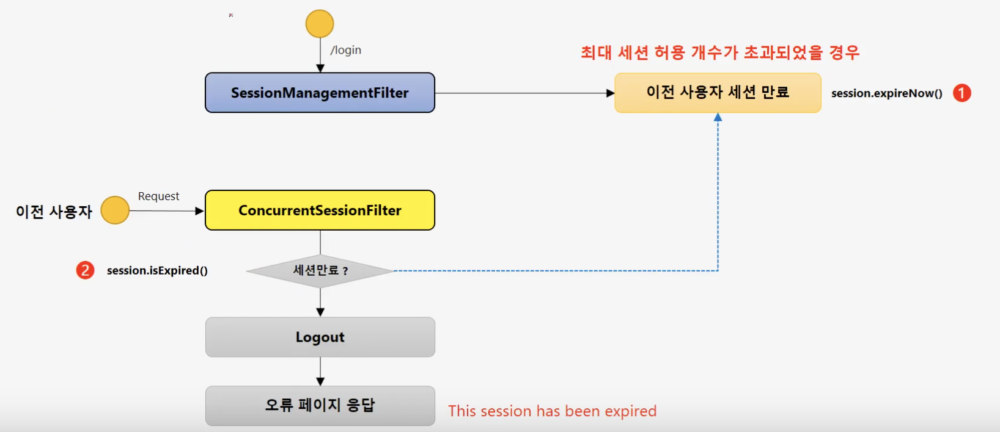
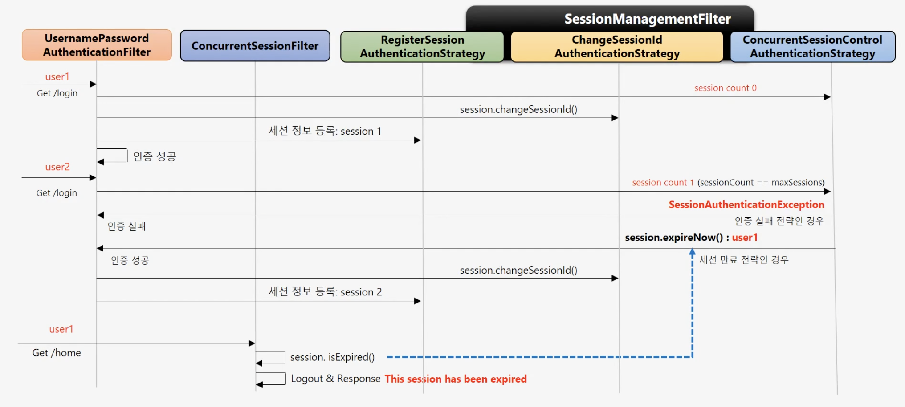

# SessionManagementFilter, ConcurrentSessionFilter

## SessionMamgermentFilter

1. 세션관리 - 인증 시 사용자의 세션정보를 등록, 조회, 삭제 등의 세션 이력을 관리
2. 동시적 세션 제어 - 동일 계정으로 접속이 허용되는 최대 세션수를 제한
3. 세션 고정 보호 - 인증 할 때마다 세션쿠키를 새로 발급하여 공격자의 쿠기 조작을 방지
4. 세션 생성 정책 - Always, If\_Required, Naver, Stateless

## ConcurrentSessionFilter

1. 매 요청 마다 현재 사용자의 세션 만료 여부 체크
2. 세션이 만료되었을 경우 즉시 만료 처리
3. session.isExpired\(\) == true
   * 로그아웃 처리
   * 즉시 오류 페이지 응답\(This session has been expired\)

sessionManagement 세션과 같이 연계해서 사용한다.\(동시적 세션 제어\)

