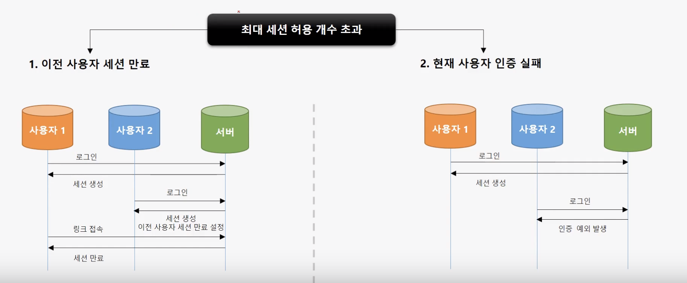
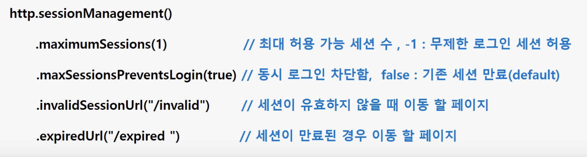
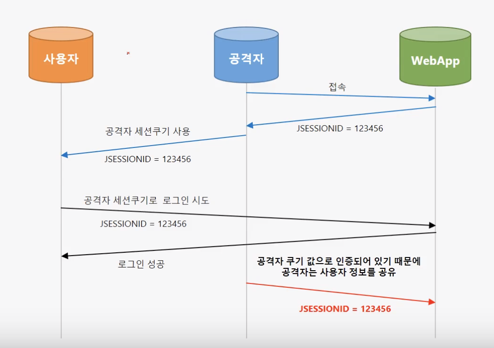
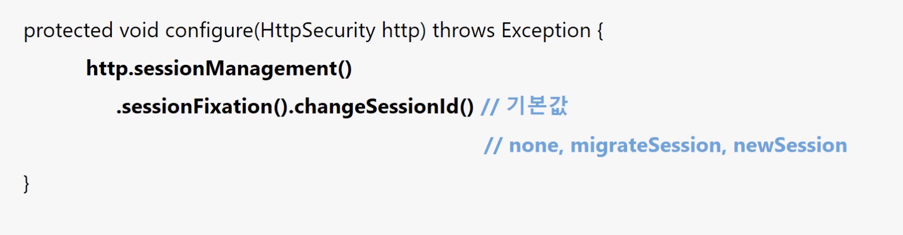
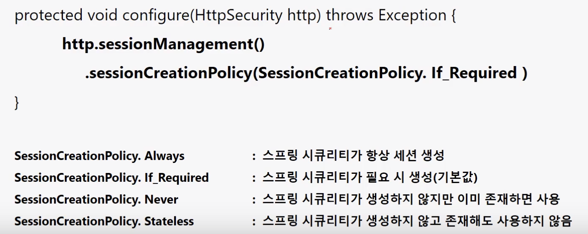

# 동시 세션 제어 / 세션고정보호/ 세션 정책

## 동시 세션 제어

동시 세션 제어는 동일한 계정으로 인증을 받았을 때 생성되는 세션. 세션이 초과되어졌을때의 관리 방법

방법은 두가지가 있다.

 1. 이전 사용자 세션 만료 , 2. 현재 사용자 인증 실패

### http.sessionManagement\(\) : 세션 관리 기능이 작동함.\(공통적으로 사용\)

##  세션고정보호

세션 고정 공격을 막기 위하여 스프링 시큐리티는 세션 고정 보호 기능을 넣어놓았다.

공격자에 대한 세션을 얻더라도 스프링 시큐리티의 인증이 성공할 때마 로운 세션과 쿠키를 만들게 하였다.

migrateSession : 이전 세션에 설정한 소수값들을 사용

newSession : 새롭게 세션을 만든다.

none : 그냥 그대로 사용한다.

## 세션 정책 

 stateless를 사용할 때가 바로 jwt\(JsonWebToken\)이다.

