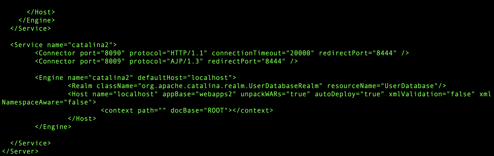

# Virtual Host(Port)

톰캣 virtual host를 포트로 관리를 하려면 service를 하나 더 선언해야 한다.

HTTP에 대한 포트번호 그리고 redirectPort도 같이 올라갈 Service와 달라야 합니다. (물론 name도 바꿔줘야 합니다.!)

그리고 webapp또한 바꿀 수 있습니다. appBase에 webapp에 대한 경로를 넣어주면 되고 안에 context에는 docBase로 ROOT설정을 해주면 됩니다.

그리고 실행을 해봤더니 AJP Address가 이미 사용되고 있다는 에러가 났습니다.

.png>)

이것을 해결하기 위해서는 AJP또한 포트번호를 바꿧어야 했습니다. 이걸 바꿧더니 정삭적으로 실행이 되었습니다.

&#x20;요번에 찾으면서 AJP에 대해서도 알았습니다.

&#x20;AJP?&#x20;

AJP는 웹서버(Apache) 뒤에 있는 어플리케이션 서버로부터 웹서버로 들어오늘 요청을 위임할 수 있는 바이너리 프로토콜이다.\
\
출처: [https://noobnim.tistory.com/26](https://noobnim.tistory.com/26) \[생각만 하지 말고 기록하자]

[https://www.lesstif.com/linux-infra-book/%EC%95%84%ED%8C%8C%EC%B9%98-%EC%9B%B9-%EC%84%9C%EB%B2%84%EC%99%80-%EC%97%B0%EB%8F%99%ED%95%98%EA%B8%B0-20776817.html](https://www.lesstif.com/linux-infra-book/%EC%95%84%ED%8C%8C%EC%B9%98-%EC%9B%B9-%EC%84%9C%EB%B2%84%EC%99%80-%EC%97%B0%EB%8F%99%ED%95%98%EA%B8%B0-20776817.html)

