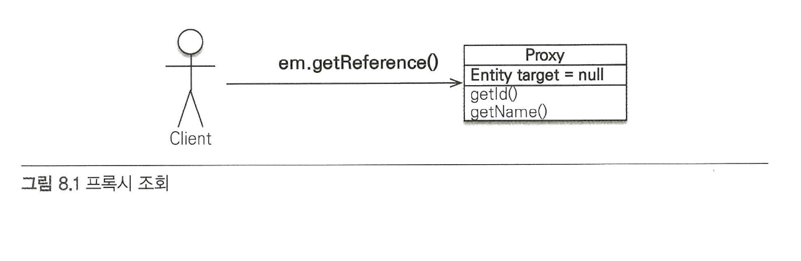
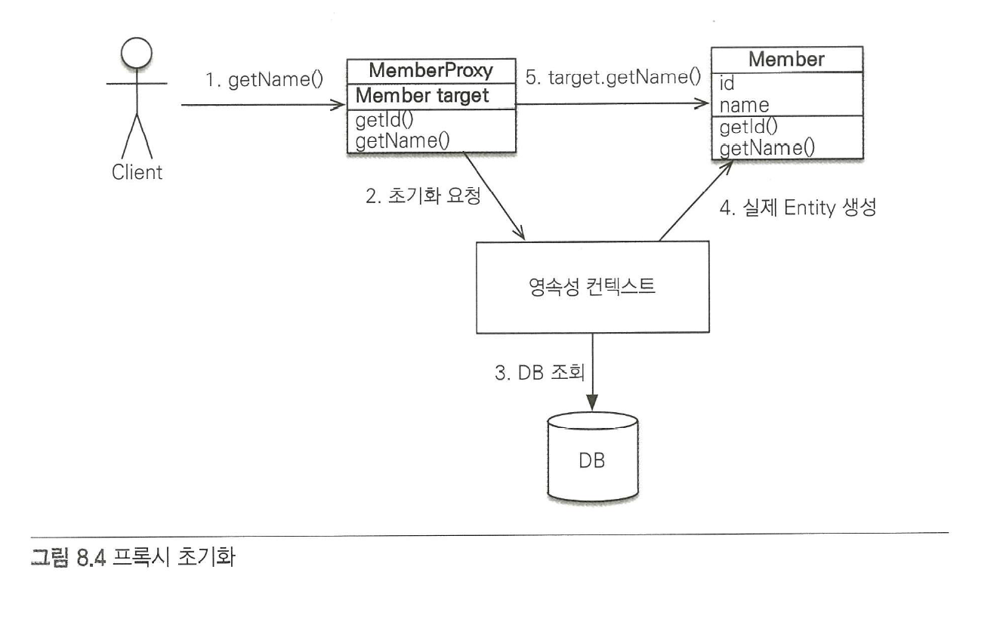

# Chap8

## 프록시와 연관관계 관리

이 장에서는 프록시와 즉시로딩, 지연로딩 그리고 영속성 전이와 고아 객체에 대해서 설명한다.

참고로 JPA 프록시는 디자인 패턴에서 프록시 패턴으로 구현되어 있습니다.

 프록시 패턴이?

 어떤 일을 대리인\(프록시\)에게 위임하여 처리하는 패턴이다. 원격 객체에 접근하기 위해 사용하거나, 이미지 로딩과 같이 객체 생성 작업이 오래걸리는 경우에 사용된다.





{% embed url="https://kihoonkim.github.io/2017/01/27/JPA\(Java%20ORM\)/4.%20JPA-%ED%94%84%EB%A1%9D%EC%8B%9C%20%EC%99%80%20%EC%A7%80%EC%97%B0%EB%A1%9C%EB%94%A9/" %}

### 프록시

```java
@Entity
public class Member { 

    private String username;

    @ManyToOne
    private Team team;

    ...

}

@Entity
public class Team { 

    private String name;

}

public void printUserAndTeam(String memberId) { 
    Member member = em.find(Member.class, memberId);
    Team team = member.getTeam();
    System.out.println("회원이름 : " + member.getUsername());
    System.out.println("소속팀 : " + team.getTeam);
}

public String printUser(String memberId) {
    Member member = em.find(Member.class , memberId);
    System.out.println("회원이름 : " + member.getUsername());
}
```

User를 불러올 때 유저와 팀을 불러오는 메서드와 유저만 불러오는 메소드만 있다.

printUserAndTeam은 팀과 회원을 전부 불러온다.

printUser는 user만 불러온다.

하지만 printUser를 조회 할때는 팀 엔티티까지 함께 조회된다.

JPA는 이 문제를 해결하기 위해서 지연 로딩을 사용한다.

이 지연 로딩 기능을 사용하려면 실제 엔티티 객체 대신에 데이터베이스 조회를 지원할 수 있는 가짜 객체가 필요한데 이것을 프록시 객체라 하다.

#### 프록시 기초

```java
Member member = em.getReference(Member.class, "member1");
```

`getReference메소드를 사용하면 엔티티를 실제 사용하는 시점까지 데이터베이스 조회를 미룰 수가 있다. 이 메소드를 호출할 때 JPA는 데이터베이스를 조회하지 않고 실제 엔티티 객체도 생성하지 않는다. 대신에 데이터베이스 접근을 위임한 프록시 객체를 반환한다.`



**프록시 객체의 초기화**

```java
Member member = em.getReference(Member.class, "id");
member.getName();
```

프록시 객체는 member.getName\(\)처럼 실제 사용할 때 데이터베이스를 조회해서 실제 엔티티 객체를 생성하는게 바로 프록시 객체의 초기화라고 말합니다..




**프록시의 특징**

1. 프록시 클래스는 실제 클래스를 상속 받아서 만들어 지므로 실제 클래스와 겉 모양이 같다.
2. 프록시 객체는 처음 사용할 때 한 번만 초기화된다.
3. 프록시 객체를 초기화한다고 프록시 객체가 실제 엔티티로 바뀌는 것은 아니다. 프록시 객체가 초기화되면 프록시 객체를 통해서 실제 엔티티에 접근할 수 있다.
4. 프록시 객체는 원본 엔티티를 상속받은 객체이므로 타입 체크 시에 주의해서 사용해야 한다.
5. 영속성 컨텍스트에 찾는 엔티티가 이미 있으면 데이터베이스를 조회할 필요가 없으므em.getReference\(\)를 호출해도 프록시가 아닌 실제 엔티티를 반환한다.
6. 초기화는 영속성 컨텍스트의 도움을 받아야 가능하다.

#### 프록시와 식별자

엔티티를 프록시로 조회할 때 식별자 값을 파라미터로 전달하는데 프록시 객체는 이 식별자 값을 보관한다.

```java
Team team = em.getReference(Team.class, "team1");
```

프록시 객체는 식별자 값을 가지고 있으므로 식별자 값을 조회하는 team.getId\(\)를 호출해도 프록시를 초기화하지 않는다.

```java
Member member = em.find(Member.class, "member1");
Team team = em.getReference(Team.class, "team1");
member.setTeam(team);
```

연관관계를 설정할 때는 식별자 값만 사용하므로 프록시를 사용하면 데이터베이스 접근 횟수를 줄일 수 있다. 참고로 연관관계를 설정할 때는 엔티티 접근 방식을 필드로 설정해도 프록시를 초기화하지 않는다.

#### 프록시 확인

```java
 boolean isLoad = em.getEntityManagerFactory()
                    .getPersistenceUnitUtil().isLoaded(entity);
// boolean isLoad = emf.getPersistenceUnitUtil().isLoaded(entity);
System.out.printl("isLoad = " + isLoad);
```

초기화되지 않는 프록시 인스턴스는 false

초기화된 프록시 인스턴스는 true

### 즉시 로딩과 지연 로딩

프록시 객체는 주로 연관된 엔티티를 지연 로딩할 때 사용한다.

#### 즉시 로딩

: 엔티티를 조회할 때 연관된 엔티티도 함께 조회한다.

* @ManyToOne\(fetch = FetchType.EAGER\)
* 즉시 로딩을 최적화하기 위해 가능하면 조인 쿼리를 사용한다.

  @JoinColumn\(nullable = true\) : NULL허용\(기본값\), 외부 조인 사용

  @JoinColumn\(nullable = false\) : NULL 허용하지 않음, 내부 조인 사용

  \*\*\*\*

**지연 로딩**

: 연관된 엔티티를 실제 사용할 때 조회한다.

* @ManyToOne\(fetch = FetchType.LAZY\)

#### 즉시 로딩, 지연 로딩

지연 로딩\(LAZY\) : 연관된 엔티티를 프록시로 조회한다. 프록시를 실제 사용할 때 초기화 하면서 데이터베이스를 조회한다.

즉시 로딩\(EAGER\) : 연관된 엔티티를 즉시 조회한다. 하이버네이트는 가능하면 SQL 조인을 사용해서 한 번에 조회한다.

#### 프록시와 컬렉션 래퍼

#### JPA 기본 페치 전략

fetch 속성의 기본 설정값은 다음과 같다.

* @ManyToOne, @OneToOne : 즉시 로딩\(FetchType.EAGER\)
* @OneToMany, @ManyToMany : 지연 로딩\(FetcheType.LAZY\)

 **즉시 로딩과 지연 로딩을 사용하여 구현할 때는 모든 연관관계에 지연 로딩을 사용하는 것이고, 개발에서 어느정도 완성이 되었을 때 필요 한 곳에만 즉시 로딩을 사용하도록 최적화하는 것이다.**

**FetchType.EAGER 사용 시 주의점**

* 컬렉션을 하나 이상 즉시 로딩하는 것은 권장하지 않는다.
* 컬렉션 즉시 로딩은 항상 외부 조인을 사용한다.
* @ManyToOne, @OneToOne
  * \(optional = false\) : 내부 조인
  * \(optional = true\) : 외부 조인
* @OneToMany, @ManyToMany
  * \(optional = false\) : 외부 조인
  * \(optional = true\) : 외부 조인

 Optional ??  바로 널어블을 허용할 것인가 말 것인가이다.?

### 영속성 전이: CASCADE

특정 엔티티를 영속 상태로 만들 때 연관된 엔티티도 함께 영속 상태로 만들고 싶으면 영속성 전이 기능을 사용하면 된다.

JPA에서 엔티티를 저장할 떄 연관된 모든 엔티티는 영속 상태여야 한다.

#### 영속성 전이 저장

```java
@OneToMany(mappedBy = "parent", cascade = CascadeType.PERSIST)
```

부모를 영속화할 때 연관된 자식들도 함께 영속화하라고 casscade = CascadeType.PERSIST 옵션을 설정했다.

엔티티를 영속화 할때 연관된 엔티티도 같이 영속화하는 편리함을 제공한다.

#### 영속성 전이 : 삭제

CascadType.REMOVE를 설정하면 부모 엔티티만 삭제하면 연관된 자식 엔티티도 함께 삭제 된다.

#### CASCADE 종류

* ALL
* PERSIST
* MERGE
* REMOVE
* REFRESH
* DETACH


[https://postitforhooney.tistory.com/entry/JavaJPAHibernate-CascadeType%EB%9E%80-%EA%B7%B8%EB%A6%AC%EA%B3%A0-%EC%A2%85%EB%A5%98](https://postitforhooney.tistory.com/entry/JavaJPAHibernate-CascadeType%EB%9E%80-%EA%B7%B8%EB%A6%AC%EA%B3%A0-%EC%A2%85%EB%A5%98)

참고

### **고아 객체**

부모 엔티티의 컬렉션에서 자식 엔티티의 참조만 제거하면 자식 엔티티가 자동으로 삭제하는 기능을 고아 객체 제거라고 한다.

orphanRemoval = ture를 사용하면 고아 객체 제거 기능이 활성화 된다.

고아 객체 제거는 참조가 제거된 엔티티는 다른 곳에서 참조하지 않는 고아 객체로 보고 삭제하는 기능이다.

@OneToOne, @OneToMany에서 사용한다.

CascadeType.REMOVE 설정한 것과 같다.

**영속성 전이 + 고아 객체, 생명주기**

CascadType.ALL + orphanRemoval = true를 동시에 사용하면 어떻게 될까?

두 옵션을 모두 활성화하면 부모 엔티티를 통해서 자식의 생명주기를 관리할 수 있다.

자식을 저장하려면 부모에 등록만 하면 된다.\(CASCADE\)

```java
 Parent parent = em.find(Parent.class, parentId);
 parent.addChild(child1);
```

자식을 삭제하려면 부모에서 제거하면 된다.\(orphanRemoval\),

```java
 Parent parent = em.find(Parent.class, parentId);
 parent.getChildren().remove(removeObject);
```

### **정리**

* JPA 구현체들은 객체 그래프를 마음껏 탐색할 수 있도록 지원하는데 이때 프록시 기술을 사용한다.
* 객체를 조회할 때 연관된 객체를 즉시 로딩하는 방법을 즉시 로딩이라 하고, 연관된 객체를 지연해서 로딩하는 방법을 지연 로딩이라 한다.
* 객체를 저장하거나 삭제할 때 연관된 객체도 함께 저장하거나 삭제할 수 있는데 이것을 영속성 전이라 한다.
* 부모 엔티티와 연관관계가 끊어진 자식 엔티티를 자동으로 삭제하려면 고아객체 제거 기능을 사용하면 된다.


ISSUE\)

영속성 컨텍스트에서 OneToOne 레이지 로딩을 할때는 연관관계의 주인이 아닐때는 LAZY로딩이 안된다.

[https://medium.com/@yongkyu.jang/jpa-%EB%8F%84%EC%9E%85-onetoone-%EA%B4%80%EA%B3%84%EC%97%90%EC%84%9C%EC%9D%98-lazyloading-%EC%9D%B4%EC%8A%88-1-6d19edf5f4d3](https://medium.com/@yongkyu.jang/jpa-%EB%8F%84%EC%9E%85-onetoone-%EA%B4%80%EA%B3%84%EC%97%90%EC%84%9C%EC%9D%98-lazyloading-%EC%9D%B4%EC%8A%88-1-6d19edf5f4d3)


