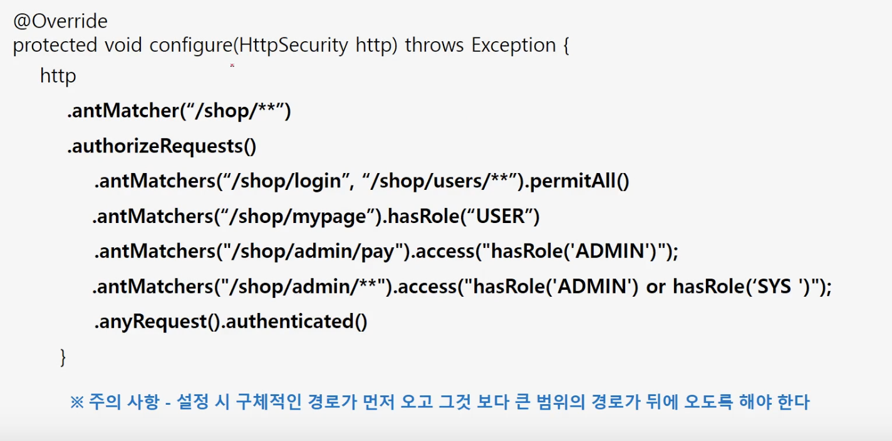
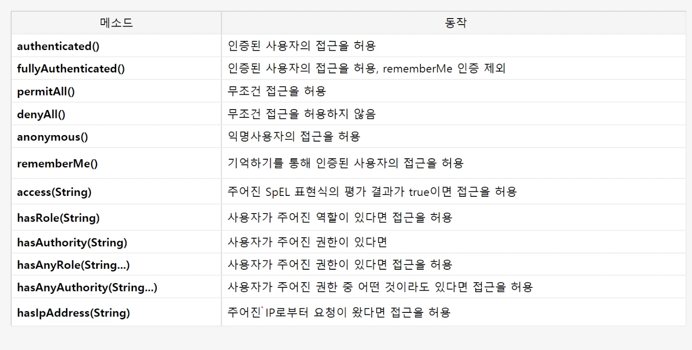

# 인가 API - 권한 설정 및 표현식

### 선언적 방식

* URL방식
  * http.antMatcher\("/user/\*\*"\).hasRole\("User"\)
*  Method
  * @PreAuthrized\("hasRole\('USER'\)"\)
  * public void user\(\){sout\('user'\)}

### 동적 방식 - DB 연동 프로그래밍

* URL
* Method

###  URL 방식

## 표현식

