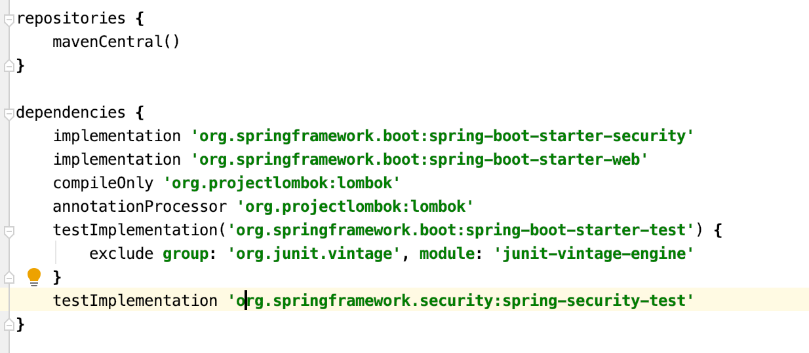
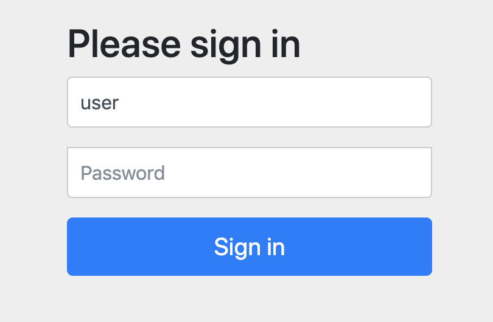

# 인증 API - 스프링 시큐리티 의존성 추가

* 스프링 시큐리티의 의존성 추가 시 일어나는 일들
  * 서버가 기동되면 스프링 시큐리티의 초기화 작업 및 보안 설정이 이루어진다.
  * 별도의 설정이나 구현을 하지 않아도 기본적인 웹 보안 기능이 현재 시스템에 연동되어 작동함
    * 모든 요청이 인증이 되어야 자원에 접근이 가능하다.
    * 인증 방식은 폼 로그인 방식과 httpBasic 로그인 방식을 제공한다.
    * 기본 로그인 페이지 제공한다.
    * 기본 계정 한 개 제공한다 - username : user / password : 랜덤 문자열
* 문제점
  * 계정 추가, 권한 추가, DB 연동 등
  * 기본적인 보안 기능 외에 시스템에서 필요로 하는 더 세부적이고 추가적인 보안기능이 필요

