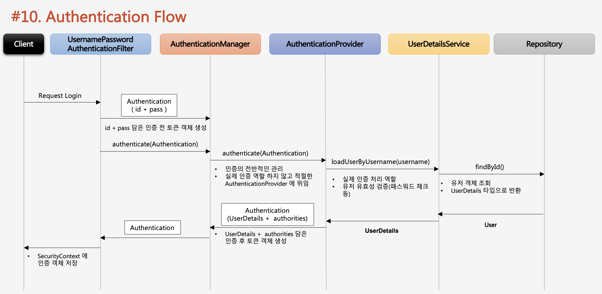

# Authentication Flow

1. AuthenticationManager 까지 1차적으로 인증하는 단계이다. 즉 인증 객체가 생성된다.
2. AuthenticationManager는 아이디 패스워드에 대한 검증은 관여하지 않고 AuthenticationProvider에게 검증을 위임한다.
3. userDetailsService를 다녀온 AuthenticationProvider는 AuthenticationManager에게  Authentication 인증객체를 만들어 유저객 및 권한정보를 전달한다.
4. AuthenticationManager는 최종적으로 받은 Authentication을 AuthenticationFilter에게 전달해주고 SecurityContext에 저장을 한다.
5. 그 후 SecurityContext내에서 전역적으로 참조가 가능해진다.
6.  그런데 role\_admin이런 애들은 어디다가 저장하는거였더라..? AuthenticationProvider에 저장된다고함.

