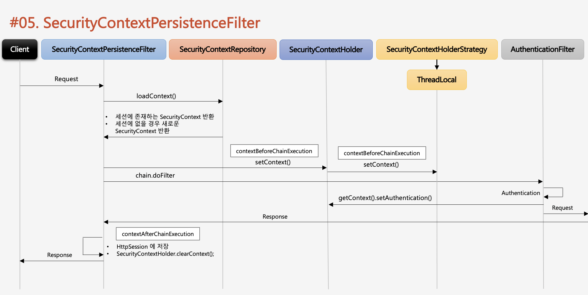

# SecurityContextPersistenceFilter

SecurityContextHolder에 저장된 SecurityContext는 그 14개의 필터에서 계속 불려져 쓰인다.

 1 .Security Context Persistence Filter는 매 요청마다 받게되도록 되어있다.

2. HttpSecurityContextRepository가 SecurityContext를 생성하고 조회하는 역할을 한다.

3. 인증전 SecurityContext는 null이다.

4. chain.doFilter에서 최종적으로 응답할 때 그 시점에 Session에 SecurityContext 저장하고 나서 Security Context를 SecurityContextHolder에서 제거한다.

5. 그 후에 응답을 준다.

6. 즉 매 요청마다 SecurityContext가 생성되고 삭제되는 구성으로 되어있다.

