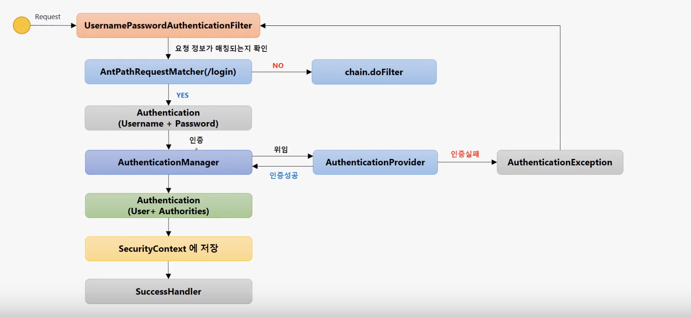

# UsernamePasswordAuthenticationFilter

### UsernamePasswordAuthenticationFilter

* 사용자 로그인에 대한 인증처리 필터이다.
* loginProcessingUrl\("/login"\)의 값을 변경하게 되면 AntPathRequestMatcher의 Url이 변한다. 
* Authentication 객체를 만들어 아이디와 패스워드를 저장한 다음에 인증처리를 한다.
* 그 후 AuthenticationManager라는 인증관리자를 이용하여 인증처리를 한다. 
* 인증처리 할때 AuthenticationProvider에다가 위임을하게 되고 인증처리를 담당하고 성공/실패에 대한 결과를 내준다.
* 실패를 하면 예외처리를 주어서 UsernamePasswordAuthenticationFilter에 다가 준다.
* 성공을 하면 user와 Authrities\(권한정보\)를 저장하여 AuthenticationManager에다가 준 뒤에 최종적인 인증객체를 Authentication 필터에게 준다.
* 그 후 성공한 인증결과를 받은 Authentication는 SecurityContext에 저장한다.
* SecurityContext는 인증 객체를 저장하는 저장소이다.
* 그 후 SuccessHandler로 간다.

