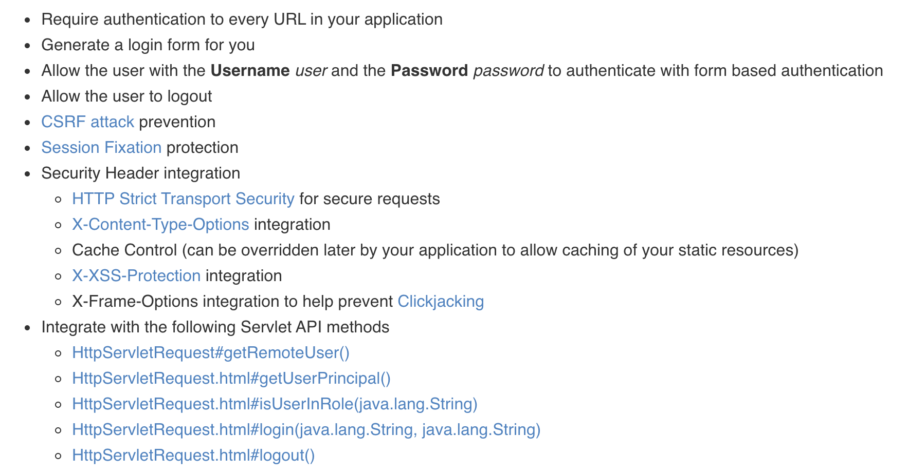

# SpringSecurity를  왜 써야할까?

 스프링 시큐리티를 공부하는 도중에 시스프링 시큐리티의 필요성에 대해서 의문이 들어서 알아보았다.

그 이유는 항상 로그인 시스템에 대해서 interceptor를 사용해서 구현했기 때문이였고, 고작 프레임워크라서 간단한 구현으로도 사용할 수 있어서인가?해서 알아보았다.

스프링 시큐리티 가이드에서는 8가지 이유에 대해 스프링 시큐리티의 특징을 적어놓았다.

1. 모든 URL에 대해서 인증을 요구한다.
2. 로그인 폼을 생성한다.
3. 기초적인 폼에 대해서 사용자 이름과 비밀번호를 요구한다.
4. 사용자에 대한 로그아웃 기능도 있다.
5. CSRF 공격을 방어한다.
   1. CSRF 공격이란 ? 사용자가 자신의 의지와는 무관하게 공격자가 의도한 행위\(수정, 삭제, 등록 등\)를 특정 웹사이트에 요청하게 하는 공격을 말한다. 출처: [https://swk3169.tistory.com/24](https://swk3169.tistory.com/24) \[swk의 지식저장소\]
6. Session Fixsation을 방어한다.
   1. 공격자가 자신의 세션 id를 다른 사용자에게 줌으로써 공격하는 방법.
7. 요청 헤드 보
   1. HSTS 강화
      1. 강제적으로 HTTPS로 접속하도록 만드는 기
      2. [https://m.blog.naver.com/PostView.nhn?blogId=aepkoreanet&logNo=221575708943&proxyReferer=https:%2F%2Fwww.google.com%2F](https://m.blog.naver.com/PostView.nhn?blogId=aepkoreanet&logNo=221575708943&proxyReferer=https:%2F%2Fwww.google.com%2F)
   2. X-Content-TypeOptions
   3. 캐시 컨트롤\(정적 리소스 캐싱\)
   4. X-XSS-Protection XSS 보안
      1. 스크립트 공격 보안
   5. 클릭재킹을 보안하기 위한 X-Frame-Options통
      1. 웹 사용자가 자신이 클릭하고 있다고 인지하는 것과 다른 어떤 것을 클릭하게 속이는 악의적인 기법으로써 잠재적으로 공격자는 비밀 정보를 유출시키거나 그들의 컴퓨터에 대한 제어를 획득할 수 있게 된다
8. Servlet API 제

 잘 보니 많은 기능들을 Spring Security에서 제공해준다. 하지만 이것을 직접 구현한다고하면 아마 많은 시간이 걸릴 것이다. 이러한 많은 기능들이 있는 스프링 시큐리티 어차피 스프링을 쓰니깐 한번 써보는 것도 나쁘지 않을 것같다.

 

